# **Course 7** - IBM Specialization - Data Analysis with Python

#### Jason Head

[Course Link](https://www.coursera.org/learn/data-analysis-with-python/home/week/1)

Topics include:  
- collecting and importing data 
- cleaning, preparing & formatting data 
- data frame manipulation 
- summarizing data 
- building machine learning regression models 
- model refinement 
- creating data pipelines

You will learn how to import data from multiple sources, clean and wrangle data, perform exploratory data analysis (EDA), and create meaningful data visualizations. You will then predict future trends from data by developing linear, multiple, polynomial regression models & pipelines and learn how to evaluate them.  

### Week 1 Importing Datasets

#### Importing Data
Two important properties
* format
    * csv, json, xlsx, etc.
* file path
    * computer: mycomputer/myfile
    * internet: https://www.....
 
Importing a csv into python \
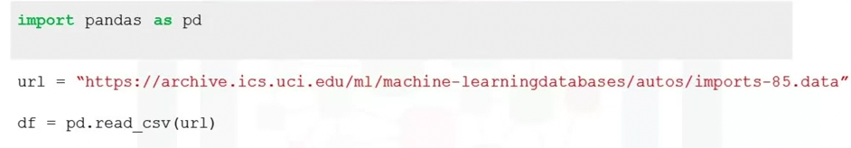

Importing a csv without a header \
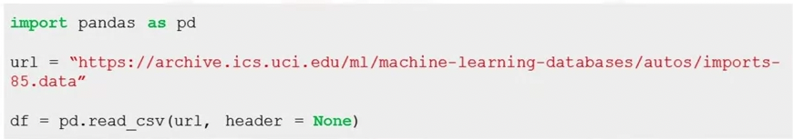

* df.head() to show the first n rows
* df.tail() to show last n rows

Adding Headers \
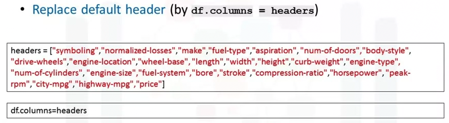

Exporting a pandas dataframe as CSV \


Exporting to different formats in Python \
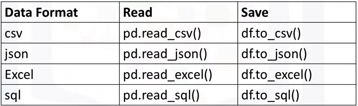

#### Getting Started Analyzing Data
* Data Types
* Data Distribution
* Locatee potential errors in the data

Data Types
* int and float very similar
* Why check data types? potential info and type mismatch and compatibility w python methods
* *df.dtypes* checks data types
* *df.describe()* returns a statiscal summary of each column to learn about the distribution of data in each column \
  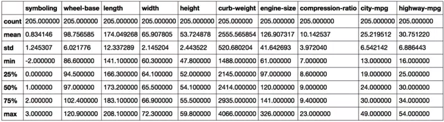

* *df.describe(include = 'all')*: Full summary statistics of all columns \
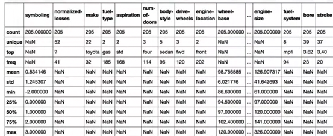

* *df.info()*: Shows the top 30 rows and the bottom 30 rows of the dataframe

#### Accessing DBs w Python
DB-API: Used to  connect with and get results from databases using Python \
Writing Code using DB-API \


### Week 2 Data Wrangling 
#### Data Pre-processing in Python
* The process of converting or mapping data from the initial "raw" form into another format, in order to prepare the data for further analysis

#### Dealing with Missing Values in Python
* Occurs when data value is stored for a variable in an observation
* "?","N/A",0 or just a blank cell

How to deal with missing data
* Check the data collection source
* Drop the missing values
    * drop the variable
    * drop the data entry: Good where not missing a lot of values
* Replacing data is better since no data is wasted, however, less accurate
    * replace w average of similar datapoints
    * replace it by frequency
    * replace it based on other functions
* Leave as missing data

How to drop missing values in Python
* df.dropna():
    * axis = 0 drops the entire *row*
    * axis = 1 drops the entire *column* 
    * inplace = True : allows the modification to be done on the dataset directly. **VERY IMPORTANT** \
 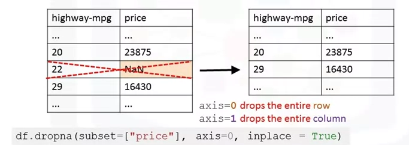

How to replace missing values in Python
* df.replace(missing_value, new_value): \
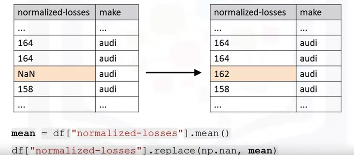

#### Data Formatting in Python
* Bringing data into a common standard of expression allows users to make meaninful comparison

Applying calculations to an entire column \
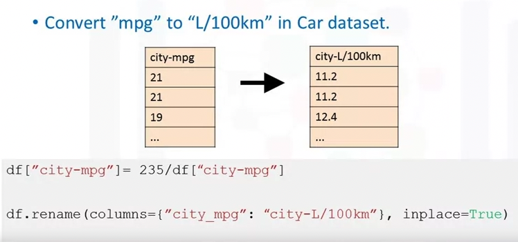

Incorrect Data Types
* df.dtypes() : Checks data type
* df.astype() : Converts data type

#### Data Normalization in Python
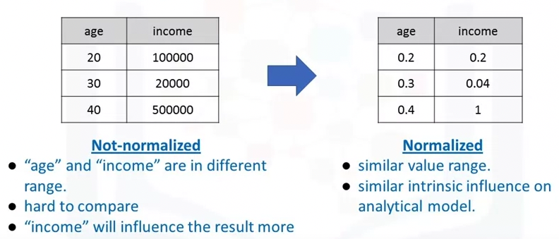

Methods of normalizing data
* *Simple Feature Scaling*: Ranges from 0 to 1; divides each value by the maximum value for that feature.
* *Min-Max*: Ranges from 0 to 1; subtracts the minimum value of that feature from each value and divides by the range of that feature
* *Z-score*: Result values hover around 0 and typically range -3 to +3; Subtract the average of that feature from each value and divide by the standard deviation
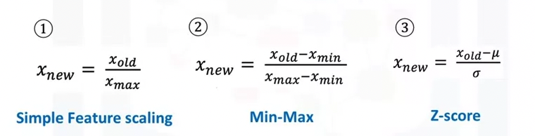

Simple Feature Scaling in Python \
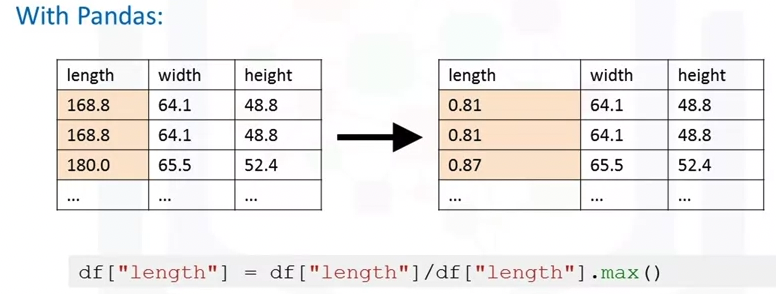

Min-max in Python \
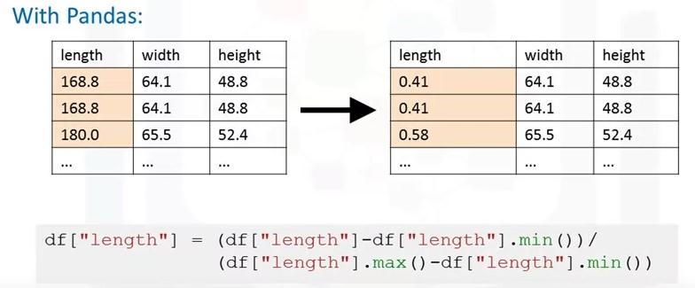

Z-score in Python \
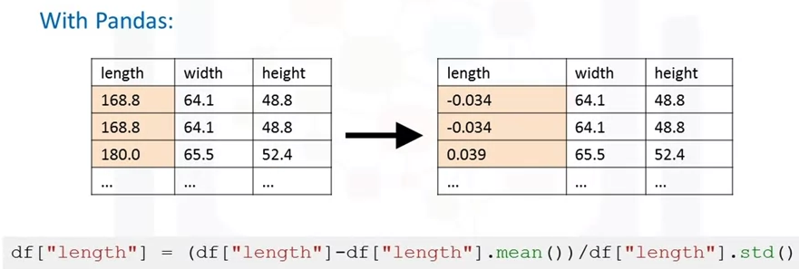 

#### Binning in Python
* Binning: Grouping values into "bins"
* Converts numeric into categorical variables
* Group a set of numerical values into a set of "bins" \
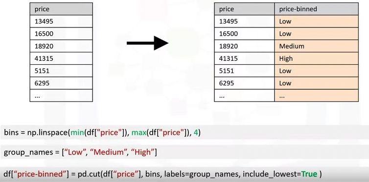

#### Turning Categorical variables into Quantitative variables in Python
* *Problem*: Most stats models cannot take in the objects / strings as input
    * "One-hot encoding": Add dummy variables for each unique category, assign 0 or 1 in each category \
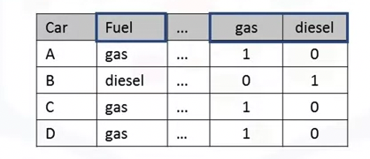

* Use pandas.get_dummies()
    * pd.get_dummies(df['fuel'])
  


```python

```
